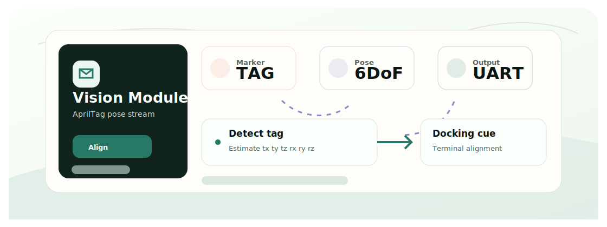

<div align="center">
  <h1>OpenMV AprilTag</h1>
  <p>AprilTag pose-estimation workspace for close-range visual localization in the Mother-Ship docking system.</p>

  <p>
    <a href="README.zh-CN.md">Chinese</a>
    &middot;
    <a href="#quickstart">Quickstart</a>
    &middot;
    <a href="#features">Features</a>
    &middot;
    <a href="#tech-stack">Tech Stack</a>
  </p>

  <p>
    
    
    
    
  </p>
</div>

<p align="center">
  
</p>

## Overview

This repo isolates the terminal vision module of the Mother-Ship docking system.

UWB handles mid-range relative localization; AprilTag vision is intended to refine close-range alignment when the tag is visible to the OpenMV camera.

## Features

- OpenMV AprilTag detection and pose-output script.
- USB VCP and UART output path for downstream devices.
- PC serial reader and 3D pose viewers.
- Archived experiments kept for reference.
- Cross-linked role with UWB and the main docking project.

## How It Works

1. Run the AprilTag script on OpenMV.
2. Estimate translation/rotation using camera intrinsics and tag size.
3. Stream pose lines over UART or USB VCP.
4. Use PC tools to verify direction, stability, and alignment behavior.
5. Feed the stream into the docking controller path when ready.

## Quickstart

Run the project locally with the commands below.

```bash
git clone https://github.com/Ha22yX/OpenMV-AprilTag.git
cd OpenMV-AprilTag
pip install -r tools/requirements.txt
# Run openmv/apriltag_pose_uart.py in OpenMV IDE
python tools/serial_reader.py
```

Calibrate camera intrinsics, tag size, serial port, and baud rate for your hardware.

## Configuration

| Item | Purpose |
| --- | --- |
| Camera intrinsics | Required for meaningful pose estimates. |
| Tag family/size | Must match printed AprilTag markers. |
| Serial output | Set UART/USB mode, port, and baud rate. |
| Coordinate convention | Verify axis direction before control integration. |

## Tech Stack

| Layer | Technology | Role |
| --- | --- | --- |
| Camera | OpenMV | Embedded AprilTag detection. |
| Marker | AprilTag TAG25H9 | Terminal visual reference. |
| Output | UART / USB VCP | Pose stream to downstream hardware. |
| Tools | Python, pyserial, matplotlib, PyQtGraph | Read and visualize pose streams. |

## Project Layout

```text
openmv/                 OpenMV camera scripts
tools/                  PC serial and 3D visualization tools
archive/                older experiments
.github/assets/         README overview asset
```

## Status

Bench-test localization module. It complements UWB and should be validated independently before flight/control use.

## Related Projects

- [Mother-Ship-Docking-Drone-System](https://github.com/Ha22yX/Mother-Ship-Docking-Drone-System) - main docking project.
- [UWB-Project](https://github.com/Ha22yX/UWB-Project) - mid-range relative localization module.

## License

No project-wide open-source license has been declared yet.
